# Meriam Raya – Game Mechanics Flowcharts

Visual reference for how every system in the game works and connects together.
For narrative descriptions see [ARCHITECTURE.md](../ARCHITECTURE.md).

**Engine:** Godot 4.3 · **Language:** GDScript · **Updated:** 2026-03-08

---

## Table of Contents

1. [Full Game Flow (Boot → End)](#1-full-game-flow-boot--end)
2. [Game State Machine](#2-game-state-machine)
3. [Scene Initialisation & Wiring](#3-scene-initialisation--wiring)
4. [Co-op Input Chain](#4-co-op-input-chain)
5. [Cannon Fire Sequence](#5-cannon-fire-sequence)
6. [Projectile Flight & Hit Detection](#6-projectile-flight--hit-detection)
7. [Target Damage & Death](#7-target-damage--death)
8. [Lives & Game-Over Flow](#8-lives--game-over-flow)
9. [Round Progression](#9-round-progression)
10. [Target Spawning](#10-target-spawning)
11. [Score Flow](#11-score-flow)
12. [Online Lobby & Network Sync](#12-online-lobby--network-sync)
13. [Signal Bus Reference](#13-signal-bus-reference)
14. [Data Resource Graph](#14-data-resource-graph)
15. [Visual Asset Replacement Map](#15-visual-asset-replacement-map)

---

## 1. Full Game Flow (Boot → End)

The top-level journey from application launch to a finished session.

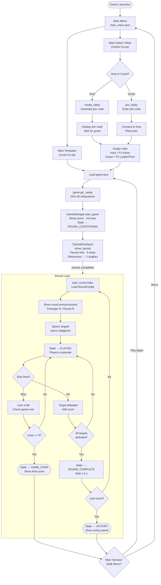

---

## 2. Game State Machine

`GameState` (`scripts/game_state_machine.gd`) is a `RefCounted` (not a Node).
It validates transitions against a fixed table; invalid moves are silently ignored.

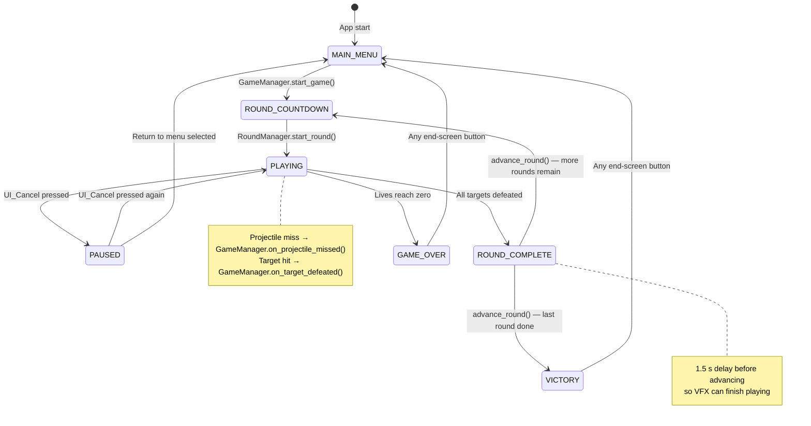

---

## 3. Scene Initialisation & Wiring

`game.gd._ready()` is the single wiring point for the entire gameplay scene.
Numbers show the sequence order. Steps 1–12 run synchronously; step 13 fires
deferred via `tutorial_completed` signal after the player dismisses the tutorial.

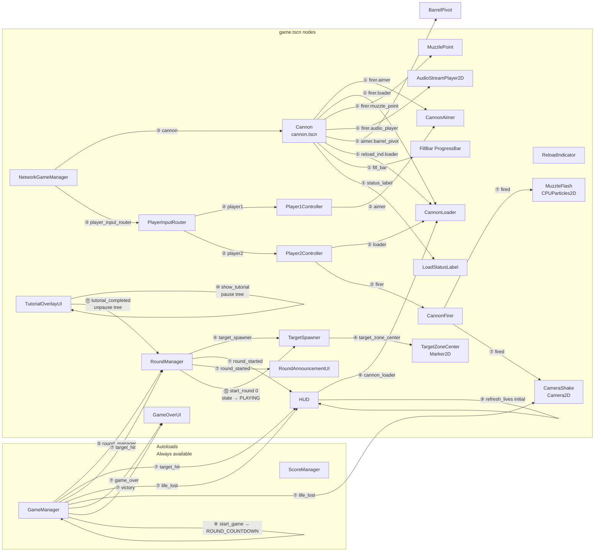

---

## 4. Co-op Input Chain

Two players share one cannon. Player 1 (Anak Sulung) aims; Player 2 (Anak Bongsu) loads and fires.

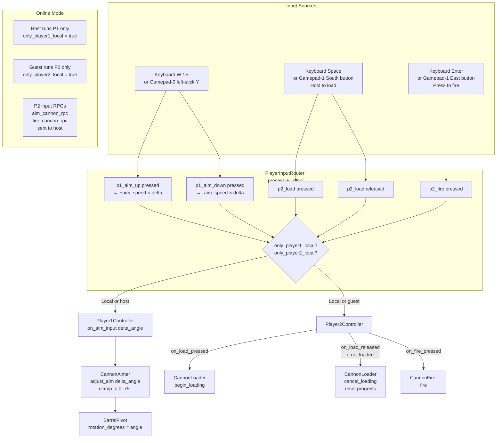

---

## 5. Cannon Fire Sequence

Detailed step-by-step of what happens from "Space held" to cooldown complete.

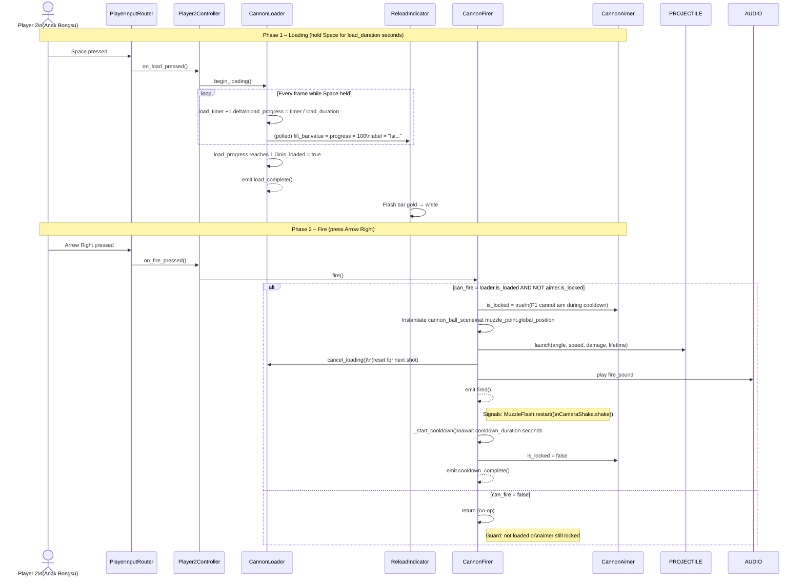

---

## 6. Projectile Flight & Hit Detection

Once launched, `CannonProjectile` (Area2D) travels in a parabolic arc.

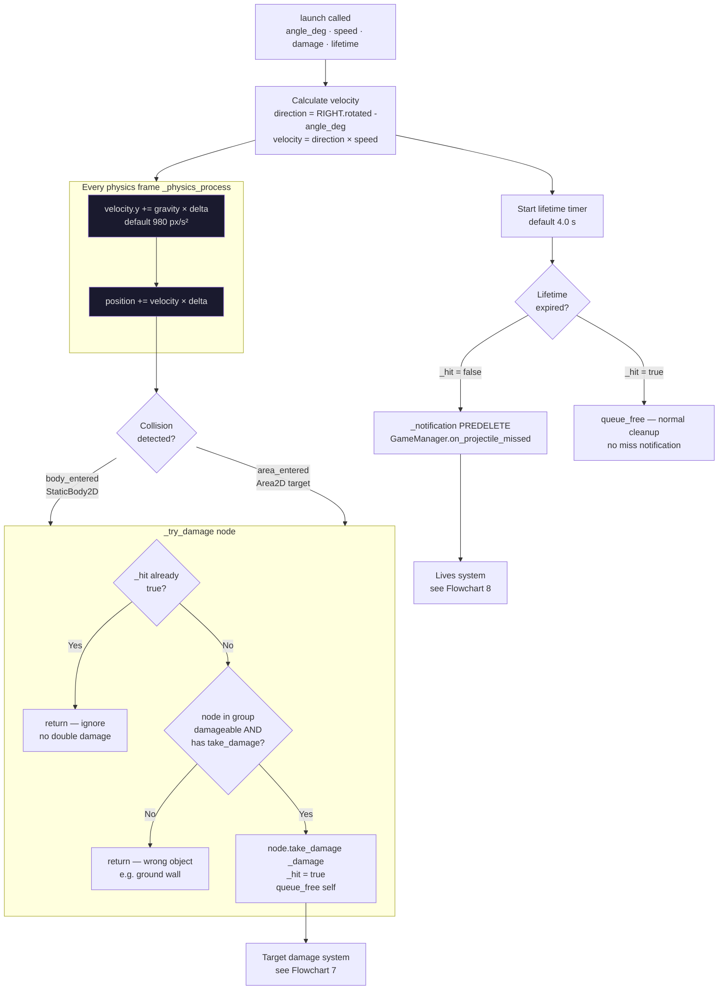

---

## 7. Target Damage & Death

All three target types share the same `take_damage` entry point via duck-typing.

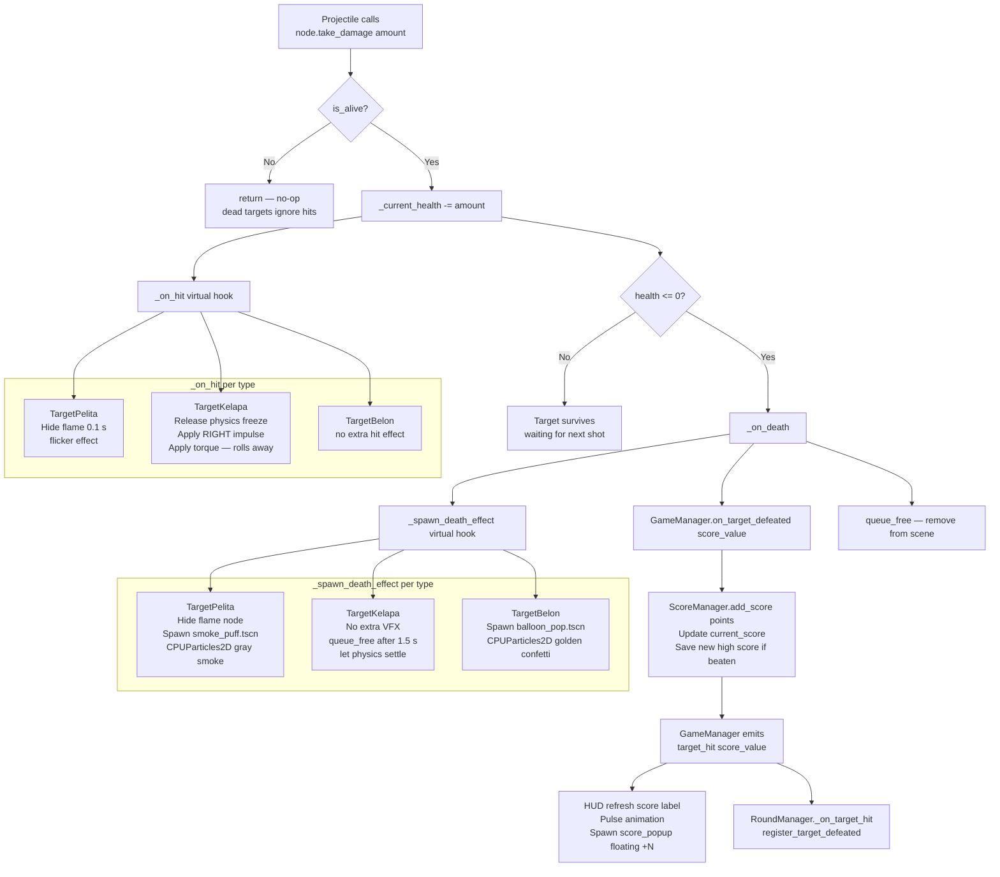

---

## 8. Lives & Game-Over Flow

A life is lost whenever a projectile expires without hitting a damageable target.
`on_projectile_missed()` is guarded so it only counts during active gameplay.

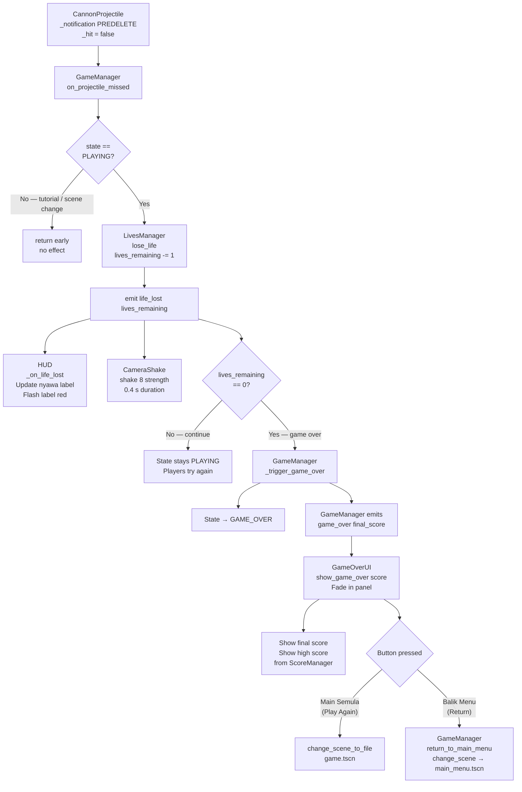

---

## 9. Round Progression

`RoundManager` sequences rounds and signals completion to `GameManager`.

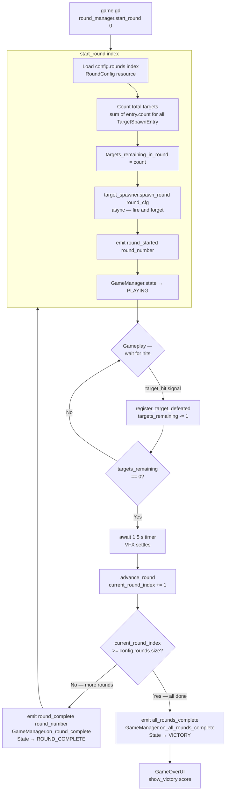

---

## 10. Target Spawning

`TargetSpawner.spawn_round()` is an async coroutine that staggers target creation.

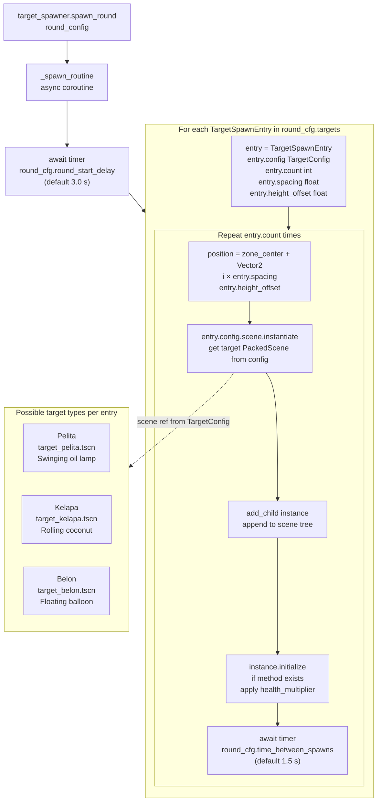

---

## 11. Score Flow

Score accumulates per target hit and persists the high score between sessions.

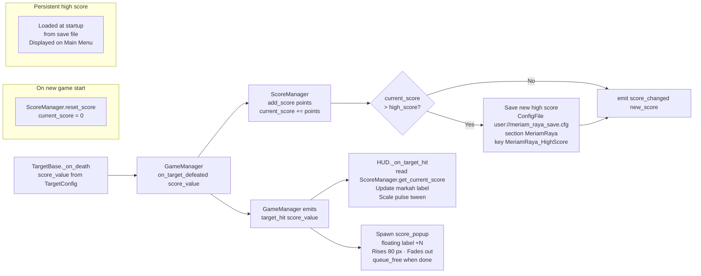

---

## 12. Online Lobby & Network Sync

Online co-op uses ENet peer-to-peer with server-authoritative state.

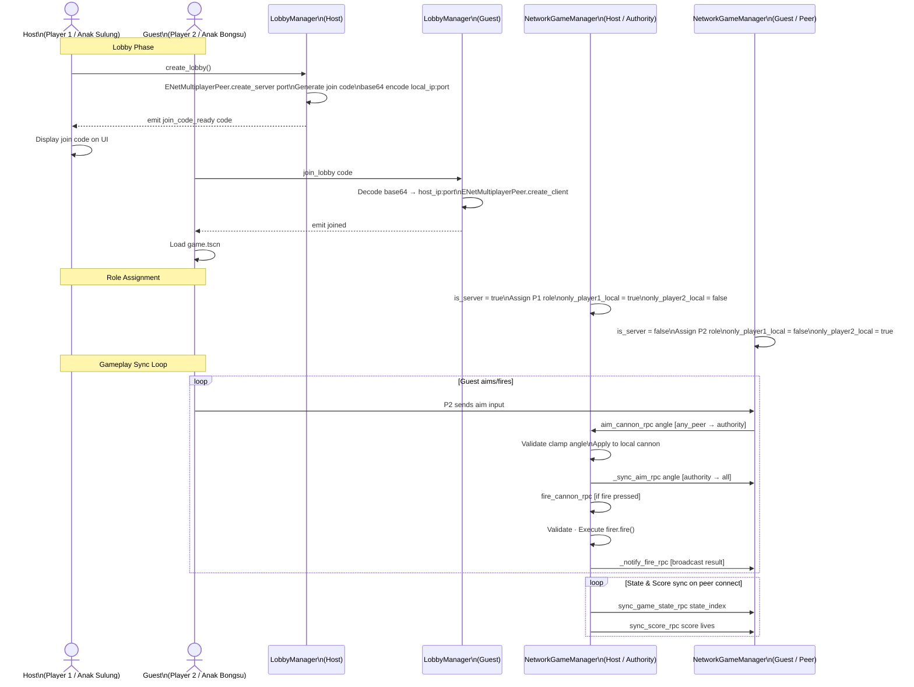

---

## 13. Signal Bus Reference

Complete map of every signal connection at runtime.

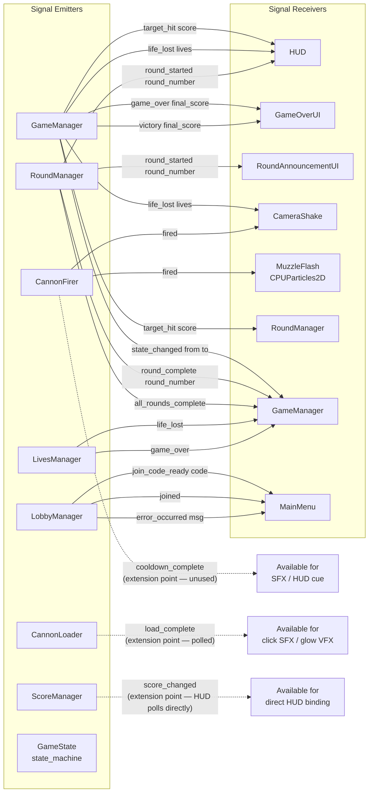

---

## 14. Data Resource Graph

All game configuration is expressed as Godot `.tres` Resource files.
Scripts, scenes, and configs form a tree of references with no circular dependencies.

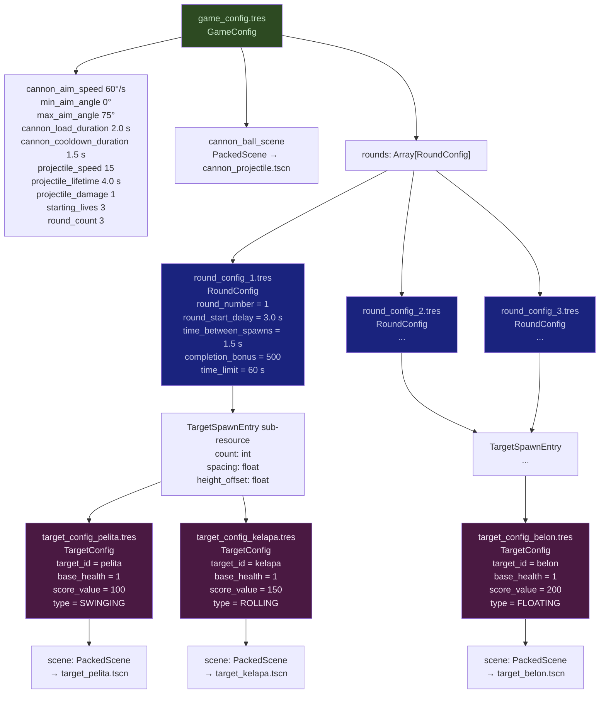

---

## 15. Visual Asset Replacement Map

All placeholder sprites (Sprite2D with no texture) that an artist should replace.
Each entry shows the script export variable to assign in the Godot Inspector.

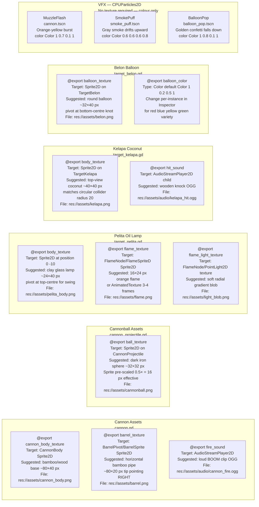

---

## Quick Reference: Key Timing Values

| Parameter | Default | Configured in |
|---|---|---|
| Cannon load duration | 2.0 s | `game_config.tres → cannon_load_duration` |
| Post-fire cooldown | 1.5 s | `game_config.tres → cannon_cooldown_duration` |
| Projectile lifetime | 4.0 s | `game_config.tres → projectile_lifetime` |
| Projectile speed | 15 px/frame | `game_config.tres → projectile_speed` |
| Barrel aim range | 0° – 75° | `game_config.tres → min/max_aim_angle` |
| Barrel aim speed | 60°/s | `game_config.tres → cannon_aim_speed` |
| Starting lives | 3 | `game_config.tres → starting_lives` |
| Round start delay | 3.0 s | `round_config_N.tres → round_start_delay` |
| Spawn stagger delay | 1.5 s | `round_config_N.tres → time_between_spawns` |
| Between-round pause | 1.5 s | Hard-coded in `round_manager.gd → advance_round` |
| Round announcement | 2.5 s | Hard-coded in `round_announcement.gd → display_duration` |
| Pelita swing | 15° · 0.8 Hz | `target_pelita.gd → swing_amplitude · swing_frequency` |
| Belon drift speed | 0.3 px/s | `target_belon.gd → drift_speed` |
| Kelapa roll force | 200 N | `target_kelapa.gd → roll_force` |
| Kelapa death delay | 1.5 s | Hard-coded in `target_kelapa.gd → _on_death` |

---

## Quick Reference: Physics Collision Layers

| Layer | Name | Used by |
|---|---|---|
| 1 | `world` | Ground / walls (StaticBody2D) |
| 2 | `cannon_projectile` | CannonProjectile Area2D |
| 3 | `target` | All target Area2D / RigidBody2D shapes |
| 4 | `ground` | Floor reference for TargetKelapa landing |

`CannonProjectile` collision_layer = 2, collision_mask = 4 (targets on layer 3 + world on layer 1).
Targets do not collide with layer 2, so projectiles cannot hit each other.

---

*See also: [ARCHITECTURE.md](../ARCHITECTURE.md) for narrative descriptions · [docs/development.md](development.md) for setup and extension guides.*
